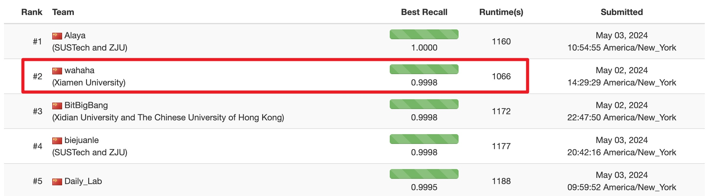

# wahaha
[Runner-up Award](https://2024.sigmod.org/sigmod_awards.shtml) code for [2024 SIGMOD Programming Contest](https://dbgroup.cs.tsinghua.edu.cn/sigmod2024/leaders.shtml)



## Introduction of `2024 SIGMOD Programming Contest`

比赛要求在20分钟内完成编译、建图、搜索、保存搜索结果等任务，因此不是一个纯搜索比赛。在纯ANNS任务上，以SIFT1M举例，8线程情况下为其构建索引通常需要30秒以上，而搜索recall在0.9时，单线程每秒搜索个数就可达到10k以上。那么假如有10k的查询，单线程就可在1秒内完成查询。因此其关键点在于构建索引的时间，赢索引者赢比赛。索引构建的时间上，NSG > HNSW = 2X kgraph = 4X RNN-Descent，在搜索效率差不多的情况下，以上数据基于我的经验，当然与建图参数有很大关系。可以看到，在比赛中我使用的建图方法是Relative NN-Descent（RNN-Descent）。

除去构建索引，这里的搜索任务是混合向量搜索。具体的，有4种子任务：
```txt
There are four types of queries, i.e., the query_type takes values from 0, 1, 2 and 3. The 4 types of queries correspond to:

If query_type=0: Vector-only query, i.e., the conventional approximate nearest neighbor (ANN) search query.
If query_type=1: Vector query with categorical attribute constraint, i.e., ANN search for data points satisfying C=v.
If query_type=2: Vector query with timestamp attribute constraint, i.e., ANN search for data points satisfying l≤T≤r.
If query_type=3: Vector query with both categorical and timestamp attribute constraints, i.e. ANN search for data points satisfying C=v and l≤T≤r.
```
先不说查询向量，就数据样本点而言，在向量本身前头，还有2个维度的数据，分别是`类别`和`时间戳`（归一化后从0-1的小数）。那么搜索时候就可以：
1. 不管这两个维度，纯搜索最近邻向量(query_type=0)；
2. 指定某个类别，搜索这个类别内的最近邻向量(query_type = 1)；
3. 指定某个时间间隔，搜索这个间隔内的最近邻向量(query_type = 2)；
4. 指定类别和时间间隔，搜索符合两个要求下的最近邻向量(query_type = 3)。

## My solution

#### 索引构建
除了索引的构建速度和用于搜索的精度，我们还要关心如何构建索引结构。因为就各个任务来分析需要构建什么样的索引。
1. query_type = 0，直接建一个普通的图索引结构即可，搜索速度飞快，最简单的一个任务。
2. query_type = 1，可以针对每个类别建立一个图索引结构，由于数据规模比整体小得多，因此搜索速度比query_type = 0还要更快，代价是建立数个小的图索引结构的耗时。
3. query_type = 2 和 query_type = 3这两个其实可以看做一个任务，只要解决了query_type = 2，那么query_type = 3就只要在小类别的图索引上搜搜即可。如何搜索呢，可以对时间等分间隔（比如10个），然后分别建图，搜索的时候10个图分别搜然后merge即可。这种方法的好处是搜索recall会很高，因为几乎不可能漏掉。但是坏处是几乎翻倍的建图时间以及非常槽糕的搜索速度（这里我们在下面「Notes-1」进一步解释）。

那么针对「query_type = 2 和 query_type = 3」如何做呢？

#### 过滤搜索（`搜索时过滤`）


先给出一种naive的思路，就是后过滤。先搜索一个大的集合，然后在上面过滤。比如要100个，先搜索1000个，然后在1000个上面过滤出符合时间间隔条件的。
好处是思路简单，但是坏处是效率低。你想，1000个是最合适的参数吗，会不会太多500个就够了；会不会太少，2000个才能过滤出100个。其次在增大搜索个数的同时，搜索速度会成倍变慢。

这里给出一种`搜索时过滤`的方法。熟悉图索引搜索的朋友们想一想图上的搜索过程，是不是和当前点的邻居计算距离后，加入一个长度有限的「候补」优先队列（实际上是2个PriorityQueue），然后从「候补」优先队列里弹出一个目前最近的点来继续搜索。最后「结果」优先队列里就是搜索得到的结果。那么既然「候补」优先队列的长度有限，是不是有一部分较远的点会被挤掉。这些被挤掉的点无法参加后过滤，但是也可能是符合时间间隔内的最近邻，为了进一步找到这些，纯后过滤的方式就要不断增大搜索个数。那么如果不增加搜索个数，而在搜索过程中就实现了与时间间隔的匹配呢？不就不用搜那么多了吗，搜索速度得到了进一步保证。此即`搜索时过滤`。

`SearchImpl2`和`SearchImpl3`分别为query_type=2和query_type=3设计的搜索时过滤的具体实现，文件位置在`mini_anns/pyanns/searcher/graph_searcher.hpp`。当然涉及到类的继承`mini_anns/pyanns/searcher`文件夹内的其他文件也有做相应修改。


## Notes
1. 数据集规模和搜索速度的关系不是线性的，可能数据规模增大10倍，速度才减少一倍。那么如果针对时间间隔等分数据集，假设原来的搜索速度是0.1s, 现在在10个小数据上的搜索速度均为0.05秒，但是有10个，就要乘10，为0.5s per query。

## Reference Links
1. Relative NN-Descent https://github.com/mti-lab/rnn-descent
2. NN-Descent (kgraph) https://github.com/aaalgo/kgraph
3. Pyanns https://github.com/veaaaab/pyanns


(below are the mini versions of rnn and kgraph. simple to use, simple to understand with the same efficiency)
1. mini_rnn  https://github.com/JieFengWang/mini_rnn
2. mini_kgraph https://github.com/JieFengWang/mini_kgraph

代码&比赛问题可以提issue，进一步沟通可以通过`jeffwang@stu.xmu.edu.cn`联系我。Any Questions are welcome.
